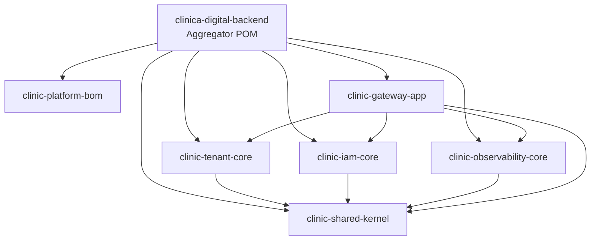

# Backend Architecture

## Scope
This document records module dependency boundaries for the Maven multi-module backend.

References: FR-003, FR-013, US2 T080.

## Module Dependency Diagram

## Dependency Rules

1. `clinic-shared-kernel` is the shared base module and must not depend on functional core modules.
2. `clinic-tenant-core` must not depend on `clinic-iam-core`.
3. `clinic-iam-core` and `clinic-observability-core` depend only on `clinic-shared-kernel` among internal modules.
4. `clinic-gateway-app` is the composition boundary and can depend on all core modules.

## Validation Notes (US2 / Phase 4.D)

- Isolated module verify executed with `mvn clean verify -pl <module>` for:
  - `clinic-tenant-core`
  - `clinic-iam-core`
  - `clinic-observability-core`
- Boundary check executed with ripgrep confirming no `com.clinicadigital.iam` imports inside `clinic-tenant-core`.
